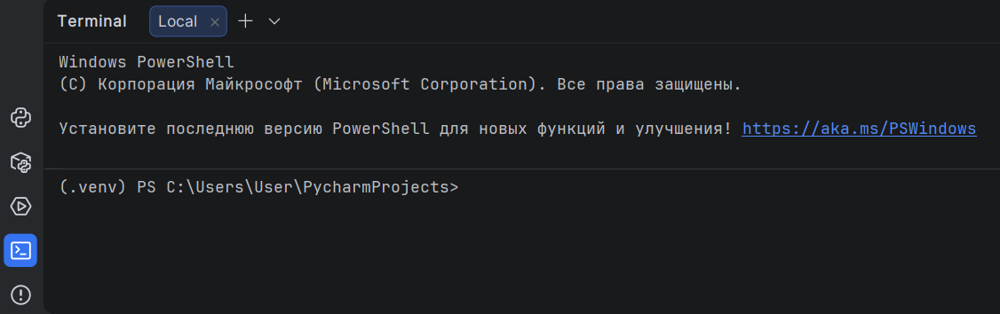
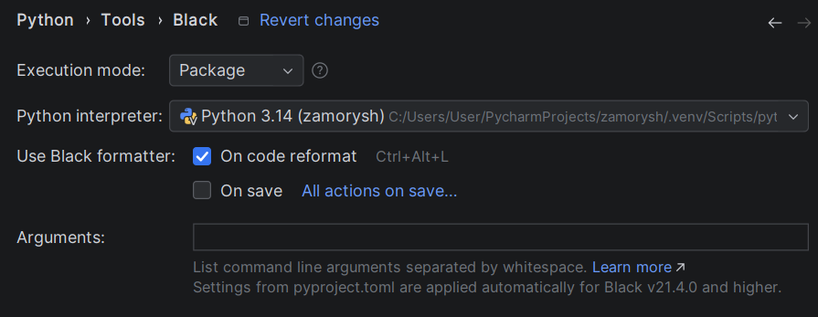
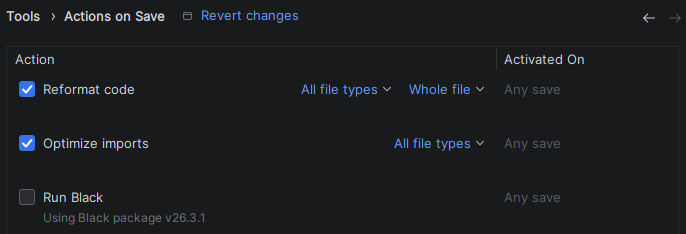

## 1. Клонируйте репозиторий

1. Откройте PyCharm.
2. Откройте встроенный терминал (иконка на левой нижней панели или `Alt+F12`).

   

3. Если вы находитесь в директории какого-то проекта, поднимитесь на уровень выше, чтобы попасть в папку, где хранятся
   все проекты:

   ```bash
   cd ..
   ```

4. Выполните команду:

   ```bash
   git clone https://github.com/kootleto/zamorysh
   ```

5. Если GitHub попросит авторизоваться, войдите через браузер.
6. В папке появится директория с именем репозитория. Откройте её в PyCharm как проект.
7. PyCharm предложит создать виртуальное окружение и установить зависимости. Нажмите `OK`.

## 2. Создайте файл `.env`

1. Убедитесь, что вы находитесь в директории проекта. Если вы находитесь в родительской папке, перейдите в директорию
   проекта:

   ```bash
   cd zamorysh
   ```

2. Создайте файл `.env` в корне проекта и скопируйте в него содержимое шаблона.

   ```bash
   cp .env.example .env
   ```

В файле `.env` хранятся параметры запуска (например, `LOG_ENABLED`), которые вы можете менять при необходимости.

## 3. Настройте Black

> [!NOTE]
> **Black** — это пакет, который автоматически форматирует Python-код, приводя его в соответствие PEP 8. Мы используем
> его, чтобы весь код в репозитории был отформатирован одинаково, а нам не приходилось отвлекаться на обсуждение
> отступов
> и переносов строк.

1. Перейдите в раздел `File -> Settings (или Ctrl+Alt+S) -> Python -> Tools -> Black`.
2. Поставьте галочку `Use Black formatter -> On code reformat`.

   
   
3. Перейдите в раздел `Tools -> Actions on Save`.
4. Поставьте галочку `Reformat code`.

   
   
5. Нажмите `OK`.

Теперь код будет автоматически форматироваться при сохранении файла.

## 4. Измените настройки PyCharm (опционально)

Возможно, вы захотите отключить эти настройки.

### Автодополнение от ИИ

1. Перейдите в раздел `File -> Settings (или Ctrl+Alt+S) -> Editor -> General -> Inline Completion`.
2. Снимите галочку `Enable local Full Line completion suggestions`.

### Авторство функций

1. Наведите курсор на какое-нибудь имя автора функции, нажмите правую кнопку мыши.
2. Выберите пункт ``Hide `Code Vision: Code author` Inlay Hints``.

## 5. Изучите основные горячие клавиши PyCharm

Хоткеи экономят массу времени и делают использование IDE гораздо приятнее. Здесь перечислено самое необходимое, но
хоткеи есть почти для любого действия. Полный список есть в разделе `File -> Settings (или Ctrl+Alt+S) -> Keymap`. Там
можно как найти любой хоткей, так и изменить его.

### Навигация

- `Ctrl + Click` | `Ctrl + B` – перейти к определению функции или класса
- `Ctrl + Shift + Alt + N` | `Cmd + Option + O` – поиск метода или переменной
- `Ctrl + Shift + N` | `Cmd + Shift + O` – поиск файла
- `Ctrl + Alt + ← / →` | `Cmd + Option + ← / →` – переход назад/вперед по коду

### Редактирование

- `Ctrl + /` | `Cmd + /` – комментировать/раскомментировать строку
- `Ctrl + D` | `Cmd + D` – дублировать строку
- `Ctrl + Shift + ↑ / ↓` | `Cmd + Shift + ↑ / ↓` – переместить строку или блок
- `Ctrl + Y` | `Cmd + Delete` – удалить строку / повторить отмененное действие (PyCharm спросит при первом
  использовании, что именно привязать к хоткею)

### Автодополнение

- `Ctrl + Space` | `Cmd + Space` – базовое автодополнение

### Запуск и отладка

- `Shift + F10` | `Ctrl + R` – запустить конфигурацию
- `Shift + F9` | `Ctrl + D` – запустить отладку
